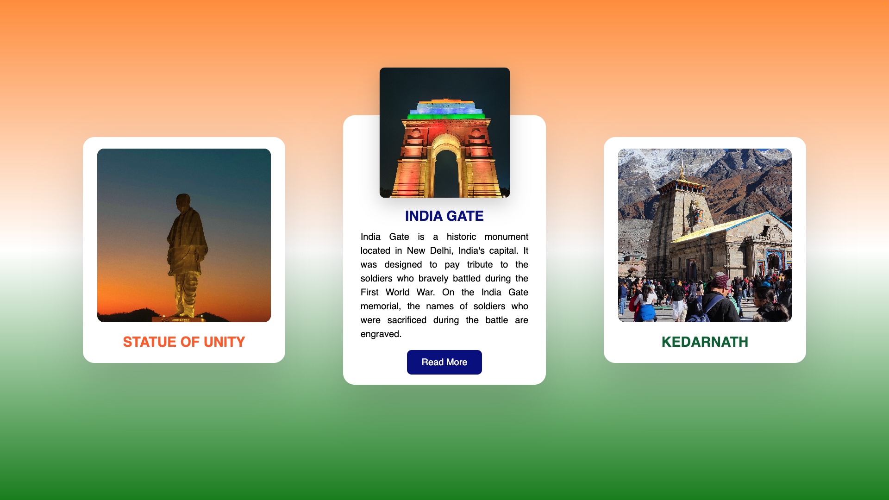

# Animated Responsive Cards Hover Effects | HTML CSS

Discover the art of creating animated and responsive cards with captivating hover effects using HTML and CSS. Our tutorial guides you through the process of designing visually stunning cards that dynamically respond to user interaction, adding an extra layer of engagement to your website. Learn how to implement impressive hover effects that bring your content to life, captivating your audience and enhancing the overall user experience. Dive into the world of web design and explore the versatility of animated responsive cards, enabling you to seamlessly integrate these eye-catching elements into your website's layout, fostering a more dynamic and interactive browsing experience for your visitors.

